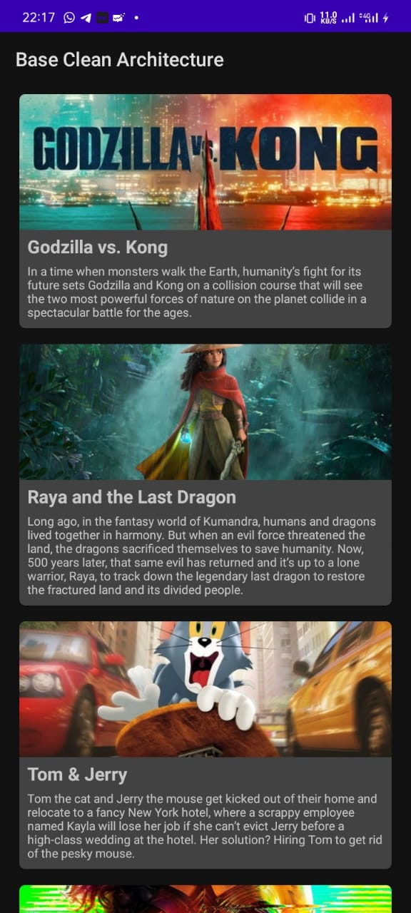

# Clean Architecture
Simple Clean Architecture Implementation based on Kotlin language for Android Mobile Development.

## Technologies
- Kotlin
- MVVM
- Live Data
- Coroutine
- Dagger-Hilt
- Retrofit2
- Data Binding
- Lifecycle
- Navigation Component
- Glide
- Shimmer Loading

## Screenshot
